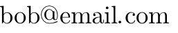

# text2image

Render images of text with this tiny command line tool.
~300k binary with no external dependencies.

- Simple CAPTCHAs
- Spam safe emails
- Rendering special fonts

Thanks to Sean Barret's [stb libraries][2]

## Usage

**Simple:**

    echo "bob@email.com" | text2image > out.png

**Full Usage:**

    echo "bob@email.com" | text2image --height 64 --font font.ttf --invert --out text.png

    tex2image --out OUTPUT --height HEIGHT --font TTF --invert
    --out	specify an output file instead of stdout.
    --height	specify height of text in pixels.
    --font	provide an alternative font file in TrueType format. (.ttf)
    --invert	draw white text on black background.
    --help	show the help text.

### What if I need more features?

Look at [ImageMagick][1].

## Project License

MIT License

Copyright (c) 2017 Justin Meiners

Permission is hereby granted, free of charge, to any person obtaining a copy of this software and associated documentation files (the "Software"), to deal in the Software without restriction, including without limitation the rights to use, copy, modify, merge, publish, distribute, sublicense, and/or sell copies of the Software, and to permit persons to whom the Software is furnished to do so, subject to the following conditions:

The above copyright notice and this permission notice shall be included in all copies or substantial portions of the Software.

THE SOFTWARE IS PROVIDED "AS IS", WITHOUT WARRANTY OF ANY KIND, EXPRESS OR IMPLIED, INCLUDING BUT NOT LIMITED TO THE WARRANTIES OF MERCHANTABILITY, FITNESS FOR A PARTICULAR PURPOSE AND NONINFRINGEMENT. IN NO EVENT SHALL THE AUTHORS OR COPYRIGHT HOLDERS BE LIABLE FOR ANY CLAIM, DAMAGES OR OTHER LIABILITY, WHETHER IN AN ACTION OF CONTRACT, TORT OR OTHERWISE, ARISING FROM, OUT OF OR IN CONNECTION WITH THE SOFTWARE OR THE USE OR OTHER DEALINGS IN THE SOFTWARE.

[1]: https://imagemagick.org/index.php
[2]: https://github.com/nothings/stb

